background-image: url("../assets/img/acsjunior_hexlogo.png")
background-position: top 15px right 15px
background-size: 12%
layout: true

```{r setup, include=FALSE, message=FALSE, warning=FALSE}
options(htmltools.dir.version = FALSE)
MAIN_COLOUR <- "#4285f4"
SECOND_COLOUR <- "#ea4335"
THIRD_COLOUR <- "#fbbc04"
library(tidyverse)
library(kableExtra)
```


---

## Quem sou eu?

### Antonio C. da Silva **Júnior**

* **Cientista de dados:** Olist (2019)

* **Analista de dados:** Hi Technologies (2018)

* **Analista de planejamento:** Techint Engenharia (2015)

<hr>

* **Especialização em Data Science e Big Data:** UFPR

* **Tecnologia em Análise e Desenvolvimento de Sistemas:** UNIP

* **Técnico em Eletrônica:** IFSP

.footnote[
Mais detalhes: [https://acsjunior.com](https://acsjunior.com)
] 

---

class: inverse, center, middle

# Uma visão geral sobre banco de dados

---
## Dado x informação

.center[
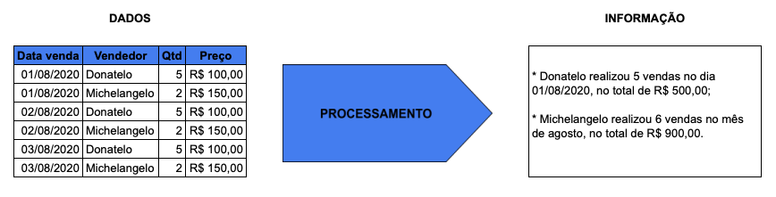
]

---


## Banco de dados

* Coleção organizada de dados armazenados eletronicamente

* Representam aspectos da realidade

.center[
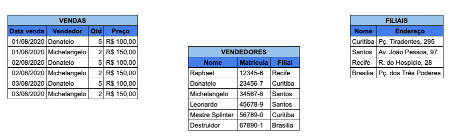
]

---


## Tabela

* Atributos (colunas)

* Registros (linhas)

.center[
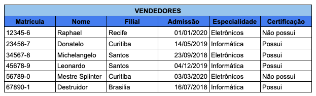
]

---


## Chave primária

* Identifica unicamente um registro, garantindo a integridade dos dados

* Possibilita o relacionamento entre tabelas

.center[
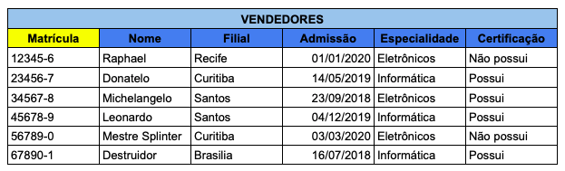
]

---


## Relacionamentos

* Associações entre tabelas

* 1:1 (um para um)

* 1:n (um para muitos)

* n:n (muitos para muitos)

---


## Relacionamento 1:1

* Cada registro da tabela A se relaciona a um ou nenhum registro da tabela B

.center[
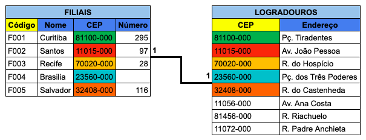
]

---


## Relacionamento 1:n

* Cada registro da tabela A relaciona com um, muitos ou nenhum registro da tabela B

.center[

]

---


## Relacionamento n:n

* Cada registro, tanto da tabela A quanto da B, pode se relacionar a nenhum, a um ou a muitos registros da outra tabela

* Necessita de uma tabela de associação

.center[
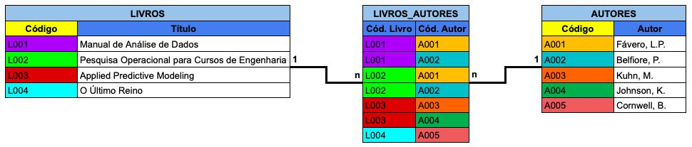
]

---


## Modelo relacional

* Diminui a redundância e as chances de inconsistência nos dados

* Foco em transação (inserção, atualização e exclusão de dados)

* Desempenho ruim em consultas

.center[
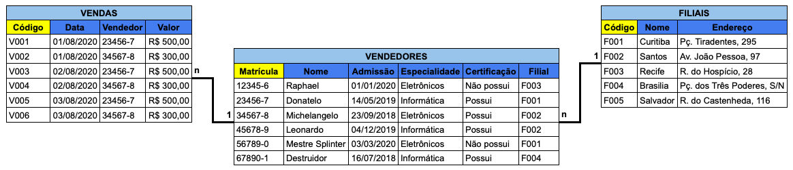
]

---


## Modelo dimensional

* Foco em consultas

* Dados redundantes, pelo fato de ser projetado para ter melhor desempenho que o modelo relacional

* Modelagem estrela (Star Schema)

* Modelagem floco de neve (Snowflake)

---


## Modelagem estrela

* Tabelas **dimensões**:
  + Representam as entidades no negócio (produto, pessoa, local, tempo...)
  + Permitem filtros e agrupamentos

* Tabela **fato**:
  + Representa os eventos (vendas, temperaturas, resultados...)
  + Permitem resumo (somatório, contagem, média...)

---

  
## Modelagem estrela
  
.center[
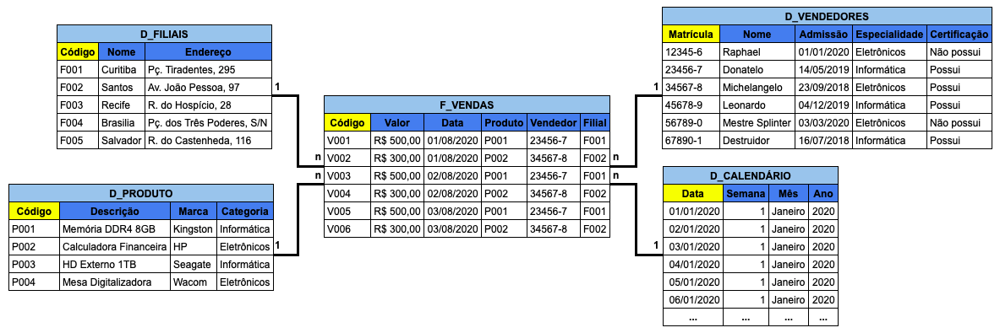
]

---


## Entendi...

.center[
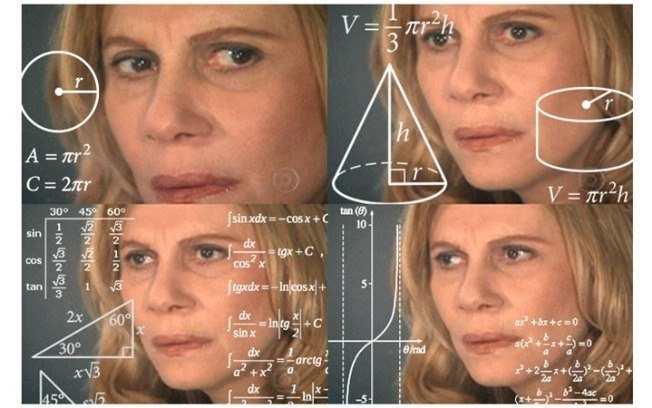
]

---


## O Data Warehouse

.center[
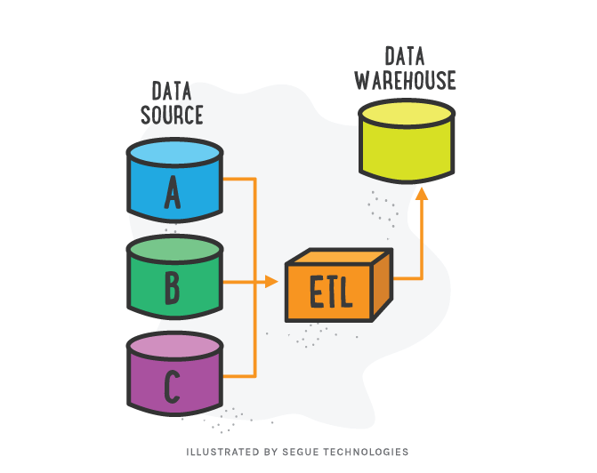
]

---


## Fontes de dados

* Bancos de dados transacionais

* Sistemas CRM: 
  + Hubspot
  + Pipedrive
  + RD Station

* Sistemas ERP: 
 + SAP
 + TOTVS
 + Salesforce

* Plataformas de web analytics: 
 + Google Analytics
 + Adobe Analytics

* Planilhas eletrônicas e outros arquivos

* Redes sociais, web scraping e dados externos

---


## O processo de ETL

* **Extract:** Extração de diversas fontes (internas e externas)

* **Transform:** Transformação, padronização, limpeza

* **Load**: Estruturação e carregamento dos dados no DW (modelagem dimensional!)

---

## Business Intelligence - BI

.center[
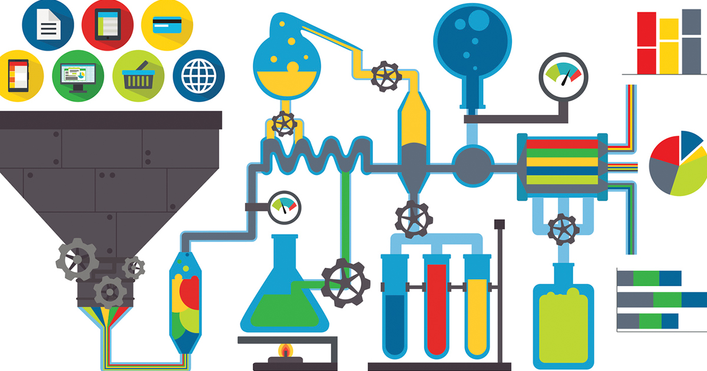
]

.footnote[
Fonte: [Qlik Blog](https://blog.qlik.com/bi-without-a-data-warehouse)
]

---

class: inverse, center, middle

# Um pouco de estatística

---

## Tipos de variáveis

* **Qualitativa (categóricas):**
  + **Nominal:** ex.) sexo, estado civil
  + **Ordinal:** ex.) tamanho (p, m, g), grau de escolaridade (1, 2, 3)
  + Tabelas de frequências

* **Quantitativa (numéricas):**
  + **Discreta:** ex.) número de leads, número clientes
  + **Contínua:** ex.) preço do produto, taxa de clientes por estado
  
* Nem toda variável representada por números é quantitativa!
  + ex.) CPF, número de telefone
  
* É possível transformar uma variável quantitativa em qualitativa:
  + ex.) idade > faixa etária
  
---

## Tabela de frequências

* Análise univariada

* Variáveis qualitativas e quantitativas discretas

.pull-left[
```{r, echo=FALSE}
df <- data.frame(Pedido = c("V001", "V002", "V003", "V004", "V005", "V006"),
                 Data = c("01/01/2020", "01/01/2020", "02/01/2020", "02/01/2020", "03/01/2020", "03/01/2020"),
                 Vendedor = c("Raphael", "Raphael", "Donatelo", "Leonardo", "Leonardo", "Leonardo"))

df %>%
  kable(caption = "Base de dados")
```
]

.pull-right[
```{r, echo=FALSE, message=FALSE, warning=FALSE}
df_freq_plot <- df %>%
  group_by(Vendedor) %>%
  summarise(Absoluta = n()) %>%
  mutate(Relativa = round(Absoluta / nrow(df), 2))
  
df_freq_plot %>%
  kable(caption = "Tabela de frequências")
```
]

---

## Tabela de frequências

* Variáveis quantitativas contínuas

.pull-left[
```{r, echo=FALSE}
df2 <- data.frame(Produto = paste0("P00",1:9),
                 Preço = c(120, 240, 410, 220, 350, 520, 180, 600, 425))

df2 %>%
  kable(caption = "Base de dados")
```
]

.pull-right[
```{r, echo=FALSE, message=FALSE, warning=FALSE}
df2$Faixa <- cut(df2$Preço, c(0, 200, 400, 600))
df2$Faixa <- factor(df2$Faixa, labels = c("0 ~ 200", "200 ~ 400", "400 ~ 600"))


df2 %>%
  group_by(Faixa) %>%
  summarise(Absoluta = n()) %>%
  mutate(Relativa = round(Absoluta / nrow(df), 2)) %>%
  kable(caption = "Tabela de frequências")
```
]

---


## Tabela de frequências - gráfico

```{r, echo=FALSE}
df_freq_plot %>%
  kable(caption = "Tabela de frequências")
```

---


## Tabela de frequências - gráfico

```{r, echo=FALSE, fig.align='center'}
ggplot(df, aes(x = Vendedor)) +
  geom_bar(fill = MAIN_COLOUR, colour = "black") +
  theme_minimal() +
  labs(x = "Vendedor", y = "Vendas realizadas", title = "Total de vendas por vendedor") +
  theme(axis.text=element_text(size=12),
        axis.title=element_text(size=14, face="bold"),
        title=element_text(size=16, face="bold"))
```

---


## Tabela de frequências - gráfico

```{r, echo=FALSE}
df_freq_plot %>%
  kable(caption = "Tabela de frequências")
```

---


## Tabela de frequências - gráfico

```{r, echo=FALSE, fig.align='center', message=FALSE, warning=FALSE}
df_group <- df %>%
  group_by(Vendedor) %>%
  summarise(n = n())

df_group$f <- df_group$n / sum(df_group$n)

ggplot(df_group, aes(x = "", y = f, fill = Vendedor)) +
  geom_bar(width = 1, stat = "identity", colour = "black") +
  scale_fill_manual(values = c(MAIN_COLOUR, SECOND_COLOUR, THIRD_COLOUR)) +
  coord_polar("y", start=0) +
  theme_minimal() +
  labs(x = "", y = "", title = "Proporção de vendas por vendedor") +
  theme(axis.text=element_text(size=12),
        axis.title=element_text(size=14, face="bold"),
        title=element_text(size=16, face="bold"),
        legend.text=element_text(size=12))
```

---

## Tabela cruzada

* Variáveis qualitativas e quantitativas discretas

---


## Tabela cruzada

.pull-left[
```{r, echo=FALSE}
df <- rbind(df, data.frame(Pedido = c("V007", "V008", "V009", "V010", "V011", "V012"),
           Data = c("04/01/2020", "04/01/2020", "05/01/2020", "05/01/2020", "06/01/2020", "06/01/2020"),
           Vendedor = c("Raphael", "Raphael", "Donatelo", "Donatelo", "Donatelo", "Raphael")))

df$Categoria <- c("Eletrônicos", "Informática", "Eletrônicos", "Informática", "Informática", "Eletrônicos", "Eletrônicos", "Eletrônicos", "Informática", "Informática", "Informática", "Informática")

df %>%
  select(-Data) %>%
  kable(caption = "Base de dados")
```
]

.pull-right[
```{r, echo=FALSE, warning=FALSE, message=FALSE}
df_cross <- df %>%
  group_by(Vendedor, Categoria) %>%
  summarise(Absoluta = n()) %>%
  pivot_wider(names_from = Categoria, values_from = Absoluta)

df_cross %>%
  kable(caption = "Tabela cruzada")
```
]

---


## Tabela cruzada - gráfico

```{r, echo=FALSE}
df_cross %>%
  kable(caption = "Tabela cruzada")
```

---


## Tabela cruzada - gráfico

```{r, echo=FALSE, fig.align='center'}
ggplot(df, aes(x = Vendedor, fill = Categoria)) +
  geom_bar(colour = "black", position = "dodge") +
  scale_fill_manual(values = c(MAIN_COLOUR, SECOND_COLOUR)) +
  theme_minimal() +
  labs(x = "Vendedor", y = "Vendas realizadas", title = "Total de vendas por vendedor") +
  theme(axis.text=element_text(size=12),
        axis.title=element_text(size=14, face="bold"),
        title=element_text(size=16, face="bold"),
        legend.text=element_text(size=12))
```


---


## Estatísticas básicas

.pull-left[
```{r, echo=FALSE}
df3 <- data.frame(Mês = c("Janeiro", "Fevereiro", "Março", "Abril", "Maio", "Junho", "Julho", "Agosto", "Setembro", "Outubro", "Novembro", "Dezembro"),
                  Curitiba = c(1768, 1341, 1588, 1612, 1836, 1307, 1341, 1425, 1688, 1556, 2194, 1877),
                  Santos = c(3490, 767, 689, 655, 757, 987, 3456, 788, 767, 790, 3109, 3257))

df3 %>%
  kable(caption = "Faturamento mensal")
```
]

.pull-right[
```{r, echo=FALSE, message=FALSE, warning=FALSE}
c_mean <- round(mean(df3$Curitiba), 2)
c_median <- round(median(df3$Curitiba), 2)
c_moda <- 1341
c_max <- max(df3$Curitiba)
c_min <- min(df3$Curitiba)
c_range <- c_max - c_min
c_var <- round(var(df3$Curitiba), 2)
c_sd <- round(sd(df3$Curitiba), 2)
c_cv <- round(sd(df3$Curitiba) / mean(df3$Curitiba), 2)

s_mean <- round(mean(df3$Santos), 2)
s_median <- round(median(df3$Santos), 2)
s_moda <- 767
s_max <- max(df3$Santos)
s_min <- min(df3$Santos)
s_range <- s_max - s_min
s_var <- round(var(df3$Santos), 2)
s_sd <- round(sd(df3$Santos), 2)
s_cv <- round(sd(df3$Santos) / mean(df3$Santos), 2)

df3_stats <- data.frame(Estatísticas = c("Média", "Mediana", "Moda", "Máximo", "Mínimo", "Amplitude", "Variância", "Desvio Padrão", "Coef. Variação"),
                        Curitiba = c(c_mean, c_median, c_moda, c_max, c_min, c_range, c_var, c_sd, c_cv),
                        Santos = c(s_mean, s_median, s_moda, s_max, s_min, s_range, s_var, s_sd, s_cv))

df3_stats %>%
  kable(caption = "Estatísticas básicas")
```

]

---

## Quartis

.pull-left[
```{r, echo=FALSE}
df3 %>%
  kable(caption = "Faturamento mensal")
```
]

.pull-right[
```{r, echo=FALSE}
c_q1 <- quantile(df3$Curitiba, .25)
c_q3 <- quantile(df3$Curitiba, .75)

s_q1 <- quantile(df3$Santos, .25)
s_q3 <- quantile(df3$Santos, .75)

df3_quantiles <- data.frame(Quartis = c("Mínimo", "Q1 (25%)", "Q2 (50%)", "Q3 (75%)", "Máximo"),
                            Curitiba = c(c_min, c_q1, c_median, c_q3, c_max),
                            Santos = c(s_min, s_q1, s_median, s_q3, s_max))

df3_quantiles %>%
  kable(caption = "Quartis")
```
]

---

## Boxplot

```{r, echo=FALSE, fig.align='center'}
df3 <- df3 %>%
  pivot_longer(cols = c("Curitiba", "Santos"))

ggplot(df3, aes(y = value, x = name)) +
  geom_boxplot(fill = MAIN_COLOUR, colour = "black") +
  theme_minimal() +
  labs(x = "Faturamento mensal", y = "Filial", title = "Distribuição do faturamento em função da filial") +
  theme(axis.text=element_text(size=12),
        axis.title=element_text(size=14, face="bold"),
        title=element_text(size=16, face="bold"))
```

---

## Gráfico de dispersão

```{r, echo=FALSE}
df4 <- data.frame(Vendas = c(156, 145, 150, 133, 108, 97, 111, 121, 153, 151),
        Temperatura = c(27.8, 25.4, 23.1, 18.5, 13.9, 11.1, 14.4, 17.5, 22.3, 20.9))

df4 %>%
  kable(caption = "Base de dados")
```

---

## Gráfico de dispersão

```{r, echo=FALSE, fig.align='center'}
ggplot(df4, aes(x = Vendas, y = Temperatura)) +
  geom_point(colour = MAIN_COLOUR, size = 5) +
  theme_minimal() +
  labs(x = "Vendas realizadas", y = "Temperatura média", title = "Temperatura média x Número de vendas") +
  theme(axis.text=element_text(size=12),
        axis.title=element_text(size=14, face="bold"),
        title=element_text(size=16, face="bold"))
```

---

## Gráfico de dispersão

```{r, echo=FALSE, fig.align='center'}
data(iris)
df_iris <- iris
names(df_iris) <- c("Compr. Sépala", "Larg. Sépala", "Compr. Pétala", "Larg. Pétala", "Espécie")

set.seed(1)
idx <- sample(1:nrow(df_iris))
df_iris <- df_iris[idx,]

df_iris %>%
  head(10) %>%
  kable(caption = "Dados sobre íris")
```

---


## Gráfico de dispersão

```{r, echo=FALSE, fig.align='center'}
ggplot(iris, aes(x = Sepal.Length, y = Petal.Length)) +
  geom_point(size = 3, alpha = 0.7, colour = MAIN_COLOUR) +
  theme_minimal() +
  labs(x = "Comprimento da sépala", y = "Comprimento da pétala", title = "Características das espécies de íris") +
  theme(axis.text=element_text(size=12),
        axis.title=element_text(size=14, face="bold"),
        title=element_text(size=16, face="bold"))
```

---

## Gráfico de dispersão

```{r, echo=FALSE, fig.align='center'}
ggplot(iris, aes(x = Sepal.Length, y = Petal.Length, colour = Species)) +
  geom_point(size = 3, alpha = 0.7) +
  scale_colour_manual(values = c(MAIN_COLOUR, SECOND_COLOUR, THIRD_COLOUR)) +
  theme_minimal() +
  labs(x = "Comprimento da sépala", y = "Comprimento da pétala", title = "Características das espécies de íris") +
  theme(axis.text=element_text(size=12),
        axis.title=element_text(size=14, face="bold"),
        title=element_text(size=16, face="bold"),
        legend.text=element_text(size=12),
        legend.position = c(0.9,0.3))
```

---

## Gráfico de linhas

```{r, echo=FALSE, message=FALSE, warning=FALSE}
df5 <- read.csv("../data/body.csv")
df5$Height <- df5$Height * 2.5400013716
df5$Height <- as.integer(df5$Height)
df5$Weight <- df5$Weight * 0.45359237

df5_group <- df5 %>%
  group_by(Gender, Height) %>%
  summarise(Avg_weight = round(mean(Weight),2))

set.seed(1)
idx <- sample(1:nrow(df5_group))
df5_group <- df5_group[idx,]

names(df5_group) <- c("Sexo", "Altura", "Peso")
df5_group$Sexo <- ifelse(df5_group$Sexo == "Male", "Masculino", "Feminino")

df5_group %>%
  head(10) %>%
  kable(caption = "Peso médio em função da altura")

```

---

## Gráfico de linhas

```{r, echo=FALSE, fig.align='center'}
df5_group %>%
  ggplot(aes(x = Altura, y = Peso)) +
  geom_line(size = 1, colour = MAIN_COLOUR) +
  theme_minimal() +
  labs(x = "Altura (cm)", y = "Peso médio (kg)", title = "Relação Peso médio x Altura") +
  theme(axis.text=element_text(size=12),
        axis.title=element_text(size=14, face="bold"),
        title=element_text(size=16, face="bold"),
        legend.text=element_text(size=12))
```

---


## Gráfico de linhas

```{r, echo=FALSE, fig.align='center'}
df5_group %>%
  ggplot(aes(x = Altura, y = Peso, colour = Sexo)) +
  geom_line(size = 1) +
  scale_colour_manual(values = c(MAIN_COLOUR, SECOND_COLOUR)) +
  theme_minimal() +
  labs(x = "Altura (cm)", y = "Peso médio (kg)", title = "Relação Peso médio x Altura") +
  theme(axis.text=element_text(size=12),
        axis.title=element_text(size=14, face="bold"),
        title=element_text(size=16, face="bold"),
        legend.text=element_text(size=12),
        legend.position = c(0.9,0.3))

```

---

class: inverse, center, middle

# Considerações finais

---

## Pontos principais

* Compreender como os dados se relacionam no negócio que estamos inseridos é fundamental;
--

* Antes de partir para a análise, ter bem definido quais perguntas desejamos responder (quem não sabe pra onde vai, qualquer caminho serve);

--
* Olhar somente para a média de forma isolada pode nos levar a conclusões inadequadas;

--
* Gráficos são fáceis de criar, independentemente da ferramenta, desde que os dados estejam no formato conveniente.

---

## Obrigado!

### Contatos:

* E-mail: [juniorssz@gmail.com](mailto:juniorssz@gmail.com?Subject=Contato)
* Página pessoal: [https://acsjunior.com](https://acsjunior.com)
* Linkedin: [in/juniorssz/](https://www.linkedin.com/in/juniorssz/)
* GitHub: [juniorssz](https://github.com/juniorssz)

.footnote[
Esta apresentação esta disponível em: [https://acsjunior.com/presentations/data_meeting.pdf](https://acsjunior.com/presentations/data_meeting.pdf) (PDF),
[https://github.com/juniorssz/presentations/tree/master/data-meeting](https://github.com/juniorssz/presentations/tree/master/data-meeting) (código)
] 
