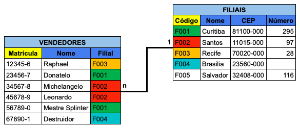
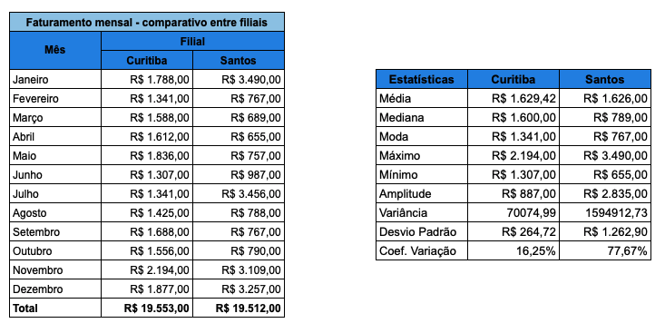
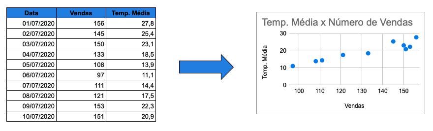

background-image: url("../assets/img/acsjunior_hexlogo.png")
background-position: top 15px right 15px
background-size: 12%
layout: true

```{r setup, include=FALSE, message=FALSE, warning=FALSE}
options(htmltools.dir.version = FALSE)
MAIN_COLOUR <- "#4285f4"
library(tidyverse)
```


---

## Quem sou eu?

### Antonio C. da Silva **Júnior**

* **Cientista de dados:** Olist (2019)

* **Analista de dados:** Hi Technologies (2018)

* **Analista de planejamento:** Techint Engenharia (2015)

<hr>

* **Especialização em Data Science e Big Data:** UFPR

* **Tecnologia em Análise e Desenvolvimento de Sistemas:** UNIP

* **Técnico em Eletrônica:** IFSP

.footnote[
Mais detalhes: [https://acsjunior.com](https://acsjunior.com)
] 

---

## Dado x informação

.center[

]

---


## Banco de dados

* Coleção organizada de dados armazenados eletronicamente

* Representam aspectos da realidade

.center[

]

---


## Tabela

* Atributos (colunas)

* Registros (linhas)

.center[

]

---


## Chave primária

* Identifica unicamente um registro, garantindo a integridade dos dados

* Possibilita o relacionamento entre tabelas

.center[

]

---


## Relacionamentos

* Associações entre tabelas

* 1:1 (um para um)

* 1:n (um para muitos)

* n:n (muitos para muitos)

---


## Relacionamento 1:1

* Cada registro da tabela A se relaciona a um ou nenhum registro da tabela B

.center[

]

---


## Relacionamento 1:n

* Cada registro da tabela A relaciona com um, muitos ou nenhum registro da tabela B

.center[

]

---


## Relacionamento n:n

* Cada registro, tanto da tabela A quanto da B, pode se relacionar a nenhum, a um ou a muitos registros da outra tabela

* Necessita de uma tabela de associação

.center[

]

---


## Modelo relacional

* Diminui a redundância e as chances de inconsistência nos dados

* Foco em transação (inserção, atualização e exclusão de dados)

* Desempenho ruim em consultas

.center[

]

---


## Modelo dimensional

* Foco em consultas

* Dados redundantes, pelo fato de ser projetado para ter melhor desempenho que o modelo relacional

* Modelagem estrela (Star Schema)

* Modelagem floco de neve (Snowflake)

---


## Modelagem estrela

* Tabelas **dimensões**:
  + Representam as entidades no negócio (produto, pessoa, local, tempo...)
  + Permitem filtros e agrupamentos

* Tabela **fato**:
  + Representa os eventos (vendas, temperaturas, resultados...)
  + Permitem resumo (somatório, contagem, média...)

---

  
## Modelagem estrela
  
.center[

]

---


## Entendi...

.center[

]

---


## O Data Warehouse

.center[

]

---


## Fontes de dados

* Bancos de dados transacionais

* Sistemas CRM: 
  + Hubspot
  + Pipedrive
  + RD Station

* Sistemas ERP: 
 + SAP
 + TOTVS
 + Salesforce

* Plataformas de web analytics: 
 + Google Analytics
 + Adobe Analytics

* Planilhas eletrônicas e outros arquivos

* Redes sociais, web scraping e dados externos

---


## O processo de ETL

* **Extract:** Extração de diversas fontes (internas e externas)

* **Transform:** Transformação, padronização, limpeza

* **Load**: Estruturação e carregamento dos dados no DW (modelagem dimensional!)

---

## Business Intelligence - BI

.center[

]

.footnote[
Fonte: [Qlik Blog](https://blog.qlik.com/bi-without-a-data-warehouse)
]

---


## Tipos de variáveis

* **Qualitativa (categóricas):**
  + **Nominal:** ex.) sexo, estado civil
  + **Ordinal:** ex.) tamanho (p, m, g), grau de escolaridade (1, 2, 3)
  + Tabelas de frequências

* **Quantitativa (numéricas):**
  + **Discreta:** ex.) número de leads, número clientes
  + **Contínua:** ex.) preço do produto, taxa de clientes por estado
  
* Nem toda variável representada por números é quantitativa!
  + ex.) CPF, número de telefone
  
* É possível transformar uma variável quantitativa em qualitativa:
  + ex.) idade > faixa etária
  
---


## Tabela de frequências

* Análise univariada (variáveis qualitativas ou quantitativas discretas)

.center[

]

---


## Tabela de frequências - gráficos

.center[

]
  
---


## Tabela cruzada

* Análise bivariada (variáveis qualitativas ou quantitativas discretas)

* Variáveis qualitativas e quantitativas discretas

.center[

]

---


## Tabela cruzada - gráfico

.center[

]

---


## Estatísticas básicas

.center[

]

---

## Quartis

.center[

]

---

## Boxplot

```{r, echo=FALSE, fig.align='center'}
Curitiba <- c(1788, 1341, 1588, 1612, 1836, 1307, 1341, 1425, 1688, 1556, 2194, 1877)
Santos <- c(3490, 767, 689, 655, 757, 987, 3456, 788, 767, 790, 3109, 3257)
df <- data.frame(Curitiba, Santos)

df <- df %>%
  pivot_longer(cols = c("Curitiba", "Santos"))

ggplot(df, aes(y = value, x = name)) +
  geom_boxplot(fill = MAIN_COLOUR) +
  theme_minimal() +
  labs(x = "Faturamento mensal", y = "Filial", title = "Distribuição do faturamento em função da filial") +
  theme(axis.text=element_text(size=12),
        axis.title=element_text(size=14, face="bold"),
        title=element_text(size=16, face="bold"))
```

---

## Gráfico de dispersão

.center[

]